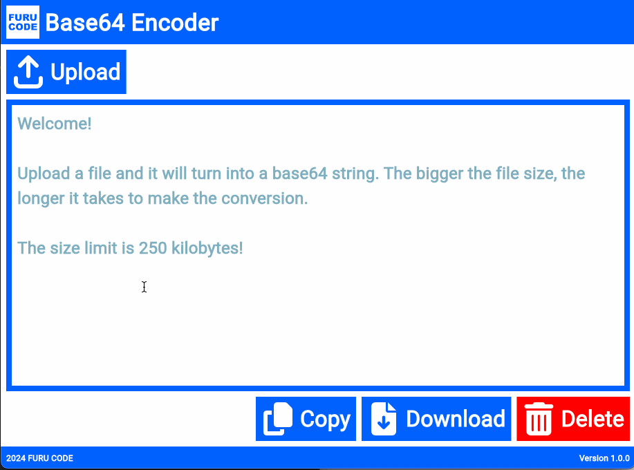

# FURUCODE Base64 Encoder 1.0.0

Upload files and encode to base64.

---

## Check the live demo [HERE](https://kennyfully88.github.io/furucode_base64_encoder_web/)

---

## Features of this product

- Turn any file that has a size up to 250kb into a base64 string.
- Popular file extensions are detected, which can append data URI to the base64 string.
- Users can append optional headers to base64 strings that have Unsupported file extensions.
- Users can copy the entire base64 string with a press of a button.
- Users can download the entire base64 string as a .txt file with a press of a button.

---

